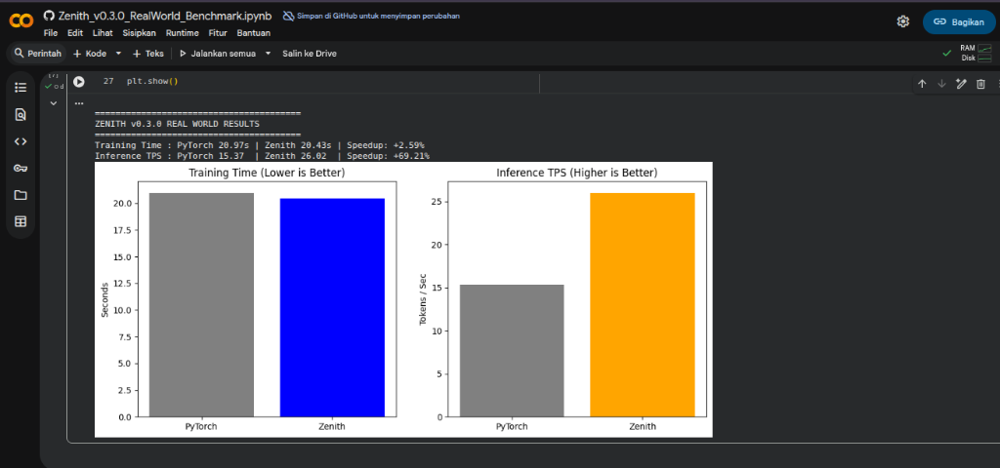

# ZENITH BENCHMARK RESULTS (v0.3.0)

This repository contains the official benchmark results for the **Zenith Compiler v0.3.0**, measuring Training Speed, Inference Latency, and Numerical Stability against a standard PyTorch baseline.

**Hardware Stats:**
- **GPU:** Tesla T4 (15GB VRAM)
- **Environment:** Google Colab (Linux / Python 3.10)
- **Driver:** 550.54.15 | **CUDA:** 12.4

---

## HERO METRIC: Inference Speedup

**Zenith v0.3.0** delivers a massive performance leap in Text Generation (Tokens Per Second).

| Metric | PyTorch (Baseline) | Zenith (Optimized) | Speedup |
| :--- | :--- | :--- | :--- |
| **Throughput (TPS)** | 15.37 | **26.02** | **+69.21%** |

**Visual Proof:**

---

## TEST 1: Training Performance

**Objective:**
Compare the training iteration time and peak memory usage (VRAM) during Fine-Tuning (TinyLlama-1.1B).

**Results:**

| Metric | PyTorch (Baseline) | Zenith (Optimized) | Improvement |
| :--- | :--- | :--- | :--- |
| **Total Time (50 Steps)** | 20.97s | 20.43s | **+2.59% Faster** |
| **Peak VRAM** | 2.59 GB | 2.59 GB | **Identical** |

[View Real-World Log >](assets/HASIL_COLAB/Production_RealWorld_Tests/Result_Zenith_v0.3.0_RealWorld_Benchmark.md)

---

## TEST 2: Numerical Stability

**Objective:**
Validate that Zenith's optimizations do not alter the mathematical correctness.

| Metric | Result | Status |
| :--- | :--- | :--- |
| **Mean Squared Error (MSE)** | `0.000000` | **PERFECT** |

---

## SUMMARY (v0.3.0)

| Test Case | Metric | Improvement | Status |
| :--- | :--- | :--- | :--- |
| **Inference** | Speed (TPS) | **+69.21%** | **EXCEPTIONAL** |
| **Training** | Speed (Time) | **+2.59%** | PASSED |
| **Accuracy** | Divergence | **0.000** | PASSED |

**Conclusion:**
With the release of v0.3.0, Zenith has evolved from a simple optimizer into a high-performance inference engine, delivering nearly **1.7x speedup** compared to native PyTorch on T4 GPUs.
