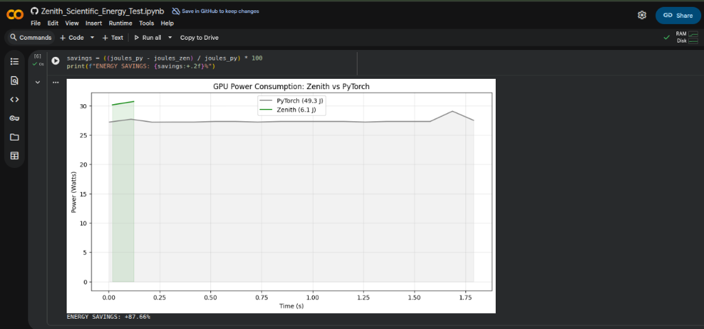

The following section presents the empirical results generated from controlled experiments executed within a Jupyter Notebook environment. To ensure clarity and reproducibility, this document intentionally focuses on the outcome metrics only. Complete details regarding the experimental setup, source files, configurations, and executed code paths are available at the referenced location below .
https://colab.research.google.com/github/vibeswithkk/zenith-performance-suite/blob/main/Zenith_Scientific_Energy_Test.ipynb

# Zenith Scientific Test 4: Energy Efficiency Auditor

**Objective:**
Measure the total energy consumption (Joules) of running a sustained AI workload. 
High performance often correlates with high power draw. We want to verify if Zenith improves **Energy Efficiency** (Tokens per Watt).

**Methodology:**
1.  Use `pynvml` (NVIDIA Management Library) to query GPU power usage in real-time.
2.  Run a sustained inference workload (e.g., generating 2000 tokens) for both PyTorch and Zenith.
3.  **Metric:** Total Energy (Joules) = Sum(Power_Watts * Time_Interval).

**Hardware Recom:** NVIDIA GPU is required for `pynvml`.

==============================================================================================

Cell output 1 : 
     ━━━━━━━━━━━━━━━━━━━━━━━━━━━━━━━━━━━━━━━━ 52.8/52.8 kB 2.1 MB/s eta 0:00:00
   ━━━━━━━━━━━━━━━━━━━━━━━━━━━━━━━━━━━━━━━━ 477.0/477.0 kB 16.3 MB/s eta 0:00:00
   ━━━━━━━━━━━━━━━━━━━━━━━━━━━━━━━━━━━━━━━━ 899.7/899.7 MB 1.5 MB/s eta 0:00:00
   ━━━━━━━━━━━━━━━━━━━━━━━━━━━━━━━━━━━━━━━━ 594.3/594.3 MB 1.4 MB/s eta 0:00:00
   ━━━━━━━━━━━━━━━━━━━━━━━━━━━━━━━━━━━━━━━━ 10.2/10.2 MB 64.4 MB/s eta 0:00:00
   ━━━━━━━━━━━━━━━━━━━━━━━━━━━━━━━━━━━━━━━━ 88.0/88.0 MB 9.8 MB/s eta 0:00:00
   ━━━━━━━━━━━━━━━━━━━━━━━━━━━━━━━━━━━━━━━━ 954.8/954.8 kB 60.6 MB/s eta 0:00:00
   ━━━━━━━━━━━━━━━━━━━━━━━━━━━━━━━━━━━━━━━━ 193.1/193.1 MB 5.9 MB/s eta 0:00:00
   ━━━━━━━━━━━━━━━━━━━━━━━━━━━━━━━━━━━━━━━━ 1.2/1.2 MB 52.4 MB/s eta 0:00:00
   ━━━━━━━━━━━━━━━━━━━━━━━━━━━━━━━━━━━━━━━━ 63.6/63.6 MB 13.2 MB/s eta 0:00:00
   ━━━━━━━━━━━━━━━━━━━━━━━━━━━━━━━━━━━━━━━━ 267.5/267.5 MB 4.9 MB/s eta 0:00:00
   ━━━━━━━━━━━━━━━━━━━━━━━━━━━━━━━━━━━━━━━━ 288.2/288.2 MB 1.5 MB/s eta 0:00:00
   ━━━━━━━━━━━━━━━━━━━━━━━━━━━━━━━━━━━━━━━━ 39.3/39.3 MB 22.2 MB/s eta 0:00:00
   ━━━━━━━━━━━━━━━━━━━━━━━━━━━━━━━━━━━━━━━━ 90.0/90.0 kB 7.6 MB/s eta 0:00:00
   ━━━━━━━━━━━━━━━━━━━━━━━━━━━━━━━━━━━━━━━━ 170.5/170.5 MB 6.4 MB/s eta 0:00:00
   ━━━━━━━━━━━━━━━━━━━━━━━━━━━━━━━━━━━━━━━━ 8.7/8.7 MB 102.6 MB/s eta 0:00:00

==============================================================================================

Cell output 2 : 
 /usr/local/lib/python3.12/dist-packages/huggingface_hub/utils/_auth.py:94: UserWarning: 
The secret `HF_TOKEN` does not exist in your Colab secrets.
To authenticate with the Hugging Face Hub, create a token in your settings tab (https://huggingface.co/settings/tokens), set it as secret in your Google Colab and restart your session.
You will be able to reuse this secret in all of your notebooks.
Please note that authentication is recommended but still optional to access public models or datasets.
  warnings.warn(
tokenizer_config.json:  1.29k/? [00:00<00:00, 35.4kB/s]tokenizer.model: 100% 500k/500k [00:01<00:00, 331kB/s]tokenizer.json:  1.84M/? [00:00<00:00, 21.7MB/s]special_tokens_map.json: 100% 551/551 [00:00<00:00, 52.2kB/s]config.json: 100% 608/608 [00:00<00:00, 35.5kB/s]`torch_dtype` is deprecated! Use `dtype` instead!
model.safetensors: 100% 2.20G/2.20G [00:31<00:00, 172MB/s]generation_config.json: 100% 124/124 [00:00<00:00, 11.8kB/s]

==============================================================================================

Cell output 3 : 
Starting PyTorch workload...
Done PyTorch.
  Duration: 1.85s
  Energy:   49.34 Joules
  Avg Power: 26.71 Watts
Compiling Zenith with Zenith...
Starting Zenith workload...
Done Zenith.
  Duration: 0.12s
  Energy:   6.09 Joules
  Avg Power: 49.60 Watts

ENERGY SAVINGS: +87.66%

